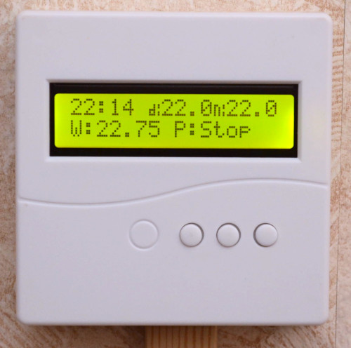
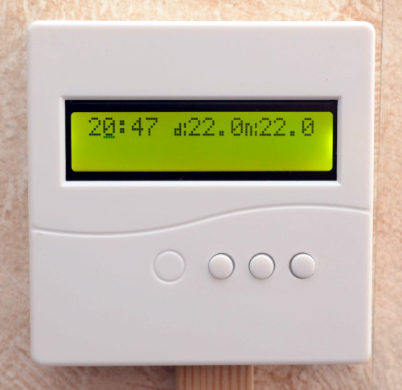
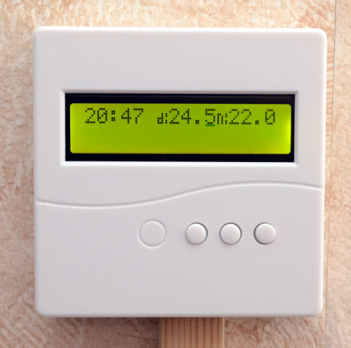

### Valden: Remote Display v1.x
<b>  This device allows you to conrol the [Valden Heat Pump](https://github.com/openhp/HeatPumpController/) via remote display. Display can be used with a wire up to few hundred meters long.</b>

## Specs
- 12V 0.5A DC power supply, 
- build-in RTC,
- Day/Night temperature set,
- LCD 16x02,
- RS485 connection to heat pump,
- secondary RS485 connection to external systems integration ( [example here](https://github.com/openhp/HP-integration-example/) ),
- JSON,
- MODBUS.

## Changelog and history
- 2019-2020: prototyping, installations, development, tests, revisions, redisigns,
- Dec 2020: [Service display](https://github.com/openhp/ServiceDisplay/) software fork created,
- Mar 2021: Documentation and release stage.
- 
## Get your own copy and PCB assembly
- download the PCB gerber file, [Valden RemoteDisplay Gerber](./Valden_RemoteDisplay_Gerber.zip)
- find in Google, [where to order a printed circuit board](https://www.google.com/search?q=order+pcb+gerber) (keywords: order pcb gerber), place an order,
- order electronic components, see BOM (Bill Of Materials) appendix below,
- solder electronic components. {- assembly instructions here-}

## Firmware upload
The process is the same as for others Arduinos:
- connect USB-> UART converter,
- start Arduino IDE,
- open the firmware file,
- select board and MCU in the Tools menu (hint: we are using "mini" board with 328p MCU),
- press the "Upload" button in the interface and "Reset" on the Arduino.

For arduinos with old bootloader you need to update it. (Tools-> Burn Bootloader). 
For successful compilation, you must have "DS3231", "LiquidCrystal" and "SoftwareSerial" installed (see Tools -> Manage Libraries). 
Note that software serial must be downloaded from the "Valden Remote Display" github repository and located at the same directory as "Remote Display" source. Library is slightly modified. 
The configuration is not required, the display will work as in the pictures below after connecting to the heat pump.    

## Wiring and installation
Wiring is very simple:  
- RS485 through a wire of the desired length connected to the Heat Pump Controller. Note that A is connected to A, B to B and GND to GND?
- you can get a 12V from the Heat Pump Controller, or from another source.
{- wiring photo here-}

## Usage
After powering on, you will see the following main screen: 
Here you'll see current time, "d:" Day setpoint temperature, "n:" Night setpoint temperature. 
Second string: "Ts1": water tank temperature (or Thi if "warm floor" scheme). And the last value is a current state, one of the following
- Run: heat pump is powered on,
- Stop: heat pump is in power-saving mode,
- Chkg: heat pump is checking target temperature (then it will go into power save mode or switched on, if temperature is lower than setpoint)
Main screen:
 
Press the "Left" and "Right" buttons together to enter the time configuration mode.    
Now you can set the time. The "Middle" button switches to the next option    
 
To set "day" or "night" temperature press "Middle" button. Then use "left" and "right" buttons to change setpoint value.
 

## License
GPLv3.  
This product is distributed in the hope that it will be useful,	but WITHOUT ANY WARRANTY; without even the implied warranty of MERCHANTABILITY or FITNESS FOR A PARTICULAR PURPOSE.  See the GNU General Public License for more details. 

## Author
 
gonzho АТ web.de (c) 2018-2021 

## Appendix A: bill of materials
| Part | Quantity |
| ------------- | ------------- |
| **1206 Resistors:**	||
| 100	  | 2 |
| 120	  | 2 |
| 1K	   | 4 |
| 10K	  | 9 | 
| 100K	 | 4 |
| **1206 Caps**	||
| 0.01uF	  | 4 |
| 0.1uF	   | 9 |
| 1uF    	 | 1 |
| 10uF	    | 10 |
| **KF124 terminals** ||
| KF124-3.81-3P	 | 2 |
| KF124-3.81-2P	 | 1 |
| **SOP(SOIC) ICs:**	||
| DS3231M     (SOIC-16)	 | 1 |
| ADM2587EBRWZ (SOIC-20)	| 2 |
| **Others:**	|				|	
| MMBT2222A (SOT-23-3)	| 1 |
| LM7805 (TO-220)	     | 1 |
| 1N4148W (SOD-123)	   | 1 |
| 0.22F  11.2x6.5 (supercap)	| 1 |
| 10nF HV-9.0x3.0 (blue disc 2kV HV cap)	| 2	|
| KLS7-TS6601-13.0-180 (13mm tact button)	| 3	|
| 2.54_pins_x40_female	      | 1 |
| 2.54_pins_x4	              | 1 |
| BUZZER-R9.0-2P-4.0				     | 1	|
| ARDUINO PRO MINI	          | 1 |
| 1602 display with i2c	     | 1 |
| 1602 Plastic case 	        | 1 |

## Author
 
gonzho АТ web.de (c) 2018-2021 
